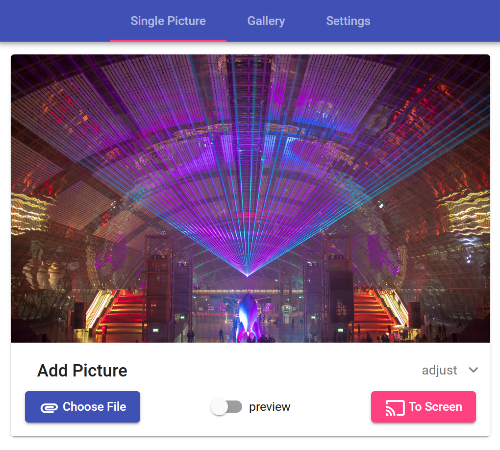

# Esp32 Picture Frame: Angular Frontend for E-Ink Display

<p align="center">

</p>

Picture frame for Waveshark's [Esp32 driver board](https://www.waveshare.com/product/displays/accessories/driver-boards/e-paper-esp32-driver-board.htm) & an epd "e-ink" display utilizing the [Arduino Framework](https://www.arduino.cc/) on [PlatformIO](https://maker.pro/arduino/tutorial/how-to-use-platformio-in-visual-studio-code-to-program-arduino) & Angular.

Work still in progress, but single image upload is already working.

## Overview
The frontend is served by the ESP32 and allows uploading images to the picture frame. The design is kept material-like utilizing  [Angular Material Components](https://material.angular.io/). 
All files to be served are stored within the ESP32's SPIFFS, this project allows easily building all frontend artifacts into pre-compressed files with just one command, see [build angular](#Build-Angular-Frontend)

## Developer Setup
Sometimes it is not easy for beginners to set up all of this, hence a detailed description.

### Arduino IDE
* Install the [Arduino IDE](https://www.arduino.cc/en/Main/Software)
* Install Esp board libs in the Arduino IDE's board manager
  * Add this at ```File > Preferences > Additional Board Manager URLs```
    ```
    https://raw.githubusercontent.com/espressif/arduino-esp32/gh-pages/package_esp32_index.json
    ```
  * Go to ```Tools > Board: xxx > Board Manager```
  * Scroll down & install 'esp32'.
  * This will take ages. Go get a drink or something. Visit friends in Paris. Write a postcard.
* Clone this repo inside your Arduino folder, usually ```C:\Users\<username>\Documents\Arduino\``` on Windows
* Use Arduino IDE to install all [Arduino dependencies](#arduino-ide-dependencies). Manually that is:
  * Download all libs from the linked repos (.zip)
  * In Arduino IDE: ```Sketch > Include Library > Add .ZIP Library```
  * Now the libs will be found when building

### Angular
* Install newest LTS Version of node.js from [here](https://nodejs.org/en/)
* Install [VSCode](https://code.visualstudio.com/) or your preferred editor
  * Cool VSCode extensions for angular:
    * [Angular Extension Pack](https://marketplace.visualstudio.com/items?itemName=loiane.angular-extension-pack) - that's an all in one bundle
    * [i18n Ally](https://marketplace.visualstudio.com/items?itemName=antfu.i18n-ally) for translation management
* Install Angular CLI: Open the ```src/angular``` folder with VSCode and go into a terminal with ```ctrl + j``` and enter
  ```
  npm install -g @angular/cli
  ```
* Install all dependencies for the angular project
  ```
  npm install
  ```
* If commands are failing because ```'ng.ps1 cannot be loaded because 
running scripts is disabled on this system'```, run 
  ```
  Set-ExecutionPolicy Unrestricted -Scope CurrentUser
  ```

### Local config files
Create a file ```src/arduino/epd_server/local_dev_config.h``` and fill with settings as follows.
```
#define wifiSettings

const char* ssid = "Your Wifi Name";
const char* password = "Your Wifi Password";
```

## Build
### Build Angular Frontend
Make sure your terminal is on the angular root path - that is ```src/angular/picture-frame-frontend``` - and run
```
npm run build-arduino
```

### Arduino / Esp32

## Debugging the ESP32
The following holds true using a FTDI2232HL "Minimodule", in this case a 
[cheap $10 breakout](https://www.aliexpress.com/i/32958712445.html) 
with the device name ```Dual RS232-HS```.

Notice that debugging won't work with the display/spi being enabled. 

* Install the ```platformio-ide``` plugin in VSCode.
* Import the project into PlatformIO
* Download & use [Zadic](https://github.com/pbatard/libwdi/releases) to install the ```Dual RS232-HS (Interface 0)``` Device as WinUSB driver.
* Edit ```platformio.ini``` to contain
  ```
  [env:esp32dev]
  platform = espressif32
  board = esp32dev
  framework = arduino
  upload_port = <YOUR COM PORT OF ESP32>
  monitor_speed = 115200
  upload_speed = 921600
  debug_tool = minimodule
  ```
* Run Debugging once (```F5```) and let it fail. If it fails and does not find your debugger, change the debugger name in
  
  C:\Users\YOURNAME\\.platformio\packages\tool-openocd-esp32\share\openocd\scripts\interface\ftdi\minimodule.cfg

  to

  ```
  ftdi_device_desc "Dual RS232-HS"
  ```

### Debugger Connection

Although some docs indicate to only connect GND, debugging only works also connecting 3V3.
Please check your own setup for this.

| JTAG Name | FTDI 2232HL Pin | ESP32 Pin |
| --------- | --------------- | --------- |
| TCK       | FTDI AD0        | GPIO13
| TDI       | FTDI AD1        | GPIO12
| TDO       | FTDI AD2        | GPIO15
| TMS       | FTDI AD3        | GPIO14
| RESET     | FTDI AC2        | EN
| GND       | FTDI GND        | GND
|           | 3V3             | 3V3

## Dependencies
### Arduino Framework Dependencies
* [GxEPD2](https://github.com/ZinggJM/GxEPD2) Waveshare lib for epd displays
* [Adafruit GFX](https://github.com/adafruit/Adafruit-GFX-Library) - can be found in lib manager to auto-install

### Angular Dependencies
See package.json for details on the angular dependencies.